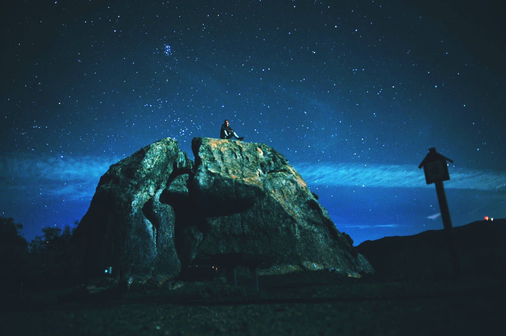

Influenced by an early life of journalism and photography, the software I enjoy building is a mixture of interfaces that experiment, and interfaces that teach. I’m most interested in work that allows me to ask questions of the overlap between art and science. I’ll always be a child of the open web.

In school I spent my time studying the world and people as a photojournalist, understanding our cycles and needs through economics, and attempting to write accessible software. You can find a full resume [here](../resume.pdf). I also spent a lot of time [researching student journalism](https://medium.com/the-open-journalism-project/the-open-journalism-project-better-student-journalism-fb39f4f701bb) with the goal of making newsrooms more experimental.

Outside of my work I spend time helping run communities in Toronto that support diversity in both [journalism](https://www.meetup.com/Hacks-Hackers-Toronto/) and [software](https://nodeschool.io/toronto/). I also spend time finding hills to climb in running shoes, and reading books to climb into different realities.

If you want to talk about a project, the best way to get in touch is either [Twitter](http://www.twitter.com/pippinlee) or [email](mailto:pippinblee@gmail.com).

Many thanks to [Z. Bryant](http://zbryant.com/) for the beaver illustration you see on the home page.

🇨🇦
